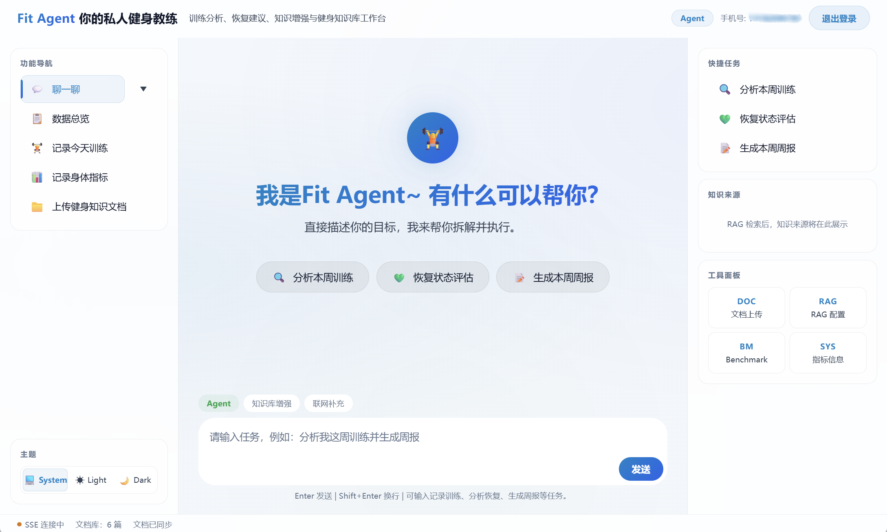

# Fit-Agent

   

   

**中文** | [English](README.md)

Fit-Agent 是一个面向健身场景的 AI 助手项目，当前仓库包含 Vue 3 前端、Spring Boot 后端、MCP 服务端与本地 RAG 数据集。系统已落地手机号验证码登录、流式聊天、Agent 执行、RAG 文档上传与检索、联网搜索、训练日志、身体指标记录，以及 RAG benchmark 评测。

## 功能概览

- 用户认证：`/user/code`、`/user/login`、`/user/logout`
- 实时聊天：`/chat/doChat`，通过 SSE 持续推送回复分片
- Agent 执行：`/agent/execute`、运行列表与详情查询
- RAG 能力：文档上传、手动检索、问答、配置读取、文档列表、`/rag/benchmark/evaluate`
- 联网搜索：基于 SearXNG 的搜索增强问答
- 健身记录：训练日志、身体指标近期摘要
- SSE 建连：ticket 模式，适配浏览器原生 `EventSource`



## 技术栈

- 前端：Vue 3、Vite 4、Element Plus、Axios
- 后端：Java 21、Spring Boot 3.5.10、Spring AI 1.0.0、MyBatis-Plus
- 数据与基础设施：MySQL、Redis、Redis Vector Store、SearXNG
- 协议与能力：SSE、MCP Client / MCP Server

## 目录结构

```text
Fit-Agent
├─ Fit-Agent-frontend/
│  ├─ src/                          # Vue 3 前端源码
│  ├─ package.json                  # 前端依赖与脚本
│  ├─ vite.config.js                # Vite 配置
│  └─ fitagent-vite.html            # 前端入口页面
├─ Fit-Agent-backend/
│  ├─ mcp-client/
│  │  ├─ src/main/java/             # 业务后端源码
│  │  ├─ src/main/resources/
│  │  │  ├─ .env.example            # 环境变量示例
│  │  │  ├─ application-dev.example.yml
│  │  │  └─ mcp-server.json         # MCP Client 连接配置
│  │  └─ pom.xml
│  ├─ mcp-server/
│  │  ├─ src/main/java/             # MCP 服务端源码
│  │  ├─ src/main/resources/
│  │  │  ├─ .env.example            # 环境变量示例
│  │  │  ├─ application-dev.example.yml
│  │  │  └─ sql/fit_agent_init.sql  # 数据库初始化脚本
│  │  └─ pom.xml
│  ├─ .gitignore
│  └─ pom.xml                       # 后端父级 Maven 工程
├─ datasets/
│  ├─ rag-mvp-fitness-v1/           # 历史 RAG 数据集
│  │  ├─ benchmark/
│  │  ├─ knowledge/
│  │  └─ sources/
│  └─ rag-mvp-fitness-v2/           # 当前数据集、benchmark 与结果汇总
│     ├─ benchmark/
│     ├─ knowledge/
│     ├─ sources/
│     └─ benchmark_result_summary.md
├─ docs/
│  ├─ database/                     # 数据库相关文档
│  ├─ API接口文档.md                # 接口文档
│  ├─ MCP工具能力说明.md            # MCP 工具说明
│  ├─ RAG检索增强生成实现流程.md     # RAG 实现流程说明
│  ├─ 登录与注册实现流程.md          # 登录注册流程说明
│  ├─ 聊天与Agent模式实现流程.md     # 聊天与 Agent 流程说明
│  └─ 语义分块与混合检索实现说明.md   # 语义分块与混合检索说明
├─ pics/
│  └─ fronted.png                   # README 截图
├─ .gitignore
├─ LICENSE
├─ README.md
└─ README_CN.md
```

## 环境要求

- Node.js 18+
- Java 21
- Maven 3.9+
- MySQL
- Redis
- SearXNG
- 可用的 OpenAI 兼容模型服务

## 配置说明

当前代码中的默认开发配置如下：

- 前端：`http://127.0.0.1:5500`
- 后端 API（`mcp-client`）：`http://127.0.0.1:7070`
- MCP Server：`http://127.0.0.1:9070`
- MySQL：`jdbc:mysql://127.0.0.1:5506/springai-items-mcp`
- Redis：`127.0.0.1:9379`
- SearXNG：`http://127.0.0.1:6080/search`
- 可选本地 embedding 服务：`http://127.0.0.1:7086`

配置示例与环境变量样例：

- `Fit-Agent-backend/mcp-client/src/main/resources/application-dev.example.yml`
- `Fit-Agent-backend/mcp-client/src/main/resources/.env.example`
- `Fit-Agent-backend/mcp-server/src/main/resources/application-dev.example.yml`
- `Fit-Agent-backend/mcp-server/src/main/resources/.env.example`

可选配置：本地 embedding 服务（`bge-m3`）

- 端口：`7086`
- 在 embedding 服务目录下执行：

```powershell
python -m uvicorn main:app --host 127.0.0.1 --port 7086
```

- 详细配置、向量索引隔离与实现说明见 `docs/RAG检索增强生成实现流程.md`。

## 快速开始

### 1. 初始化数据库

导入初始化脚本：`Fit-Agent-backend/mcp-server/src/main/resources/sql/fit_agent_init.sql`

### 2. 启动后端服务

建议分别在两个终端启动：

```powershell
cd Fit-Agent-backend
mvn -pl mcp-server -am spring-boot:run
```

```powershell
cd Fit-Agent-backend
mvn -pl mcp-client -am spring-boot:run
```

### 3. 启动前端

```powershell
cd Fit-Agent-frontend
npm install
npm run dev -- --host 127.0.0.1 --port 5500
```

访问：`http://127.0.0.1:5500/fitagent-vite.html`

## 功能介绍

- 认证与会话链路：支持手机号验证码登录、token 鉴权，以及基于 SSE ticket 的流式连接建立，覆盖完整会话入口。
- 对话与 Agent 执行：支持普通流式聊天、Agent 任务执行和运行状态查询，满足问答与任务协同两类场景。
- RAG 知识增强：支持文档上传、检索、知识问答和 benchmark 评测；embedding 层也支持接入本地部署的 `bge-m3` 模型。
- 联网搜索与健身记录：支持基于 SearXNG 的搜索增强问答，同时提供训练日志和身体指标记录能力。
- 语义分块与混合检索：当前项目代码已支持可配置的语义分块与混合检索能力，RAG 检索链路可结合向量召回与关键词检索。在混合检索完成融合后，系统还支持对融合候选执行可选重排，再返回最终 TopK 结果。
- MCP 工具支持：项目内置 MCP 服务端，当前提供时间查询、邮件发送、训练日志、身体指标以及 RAG 文档与评测查询等工具能力，便于 Agent 以结构化方式调用。详见 `docs/MCP工具能力说明.md`。

## 注意事项

- 受保护接口正式只信任 `headerUserToken`；前端默认从 cookie `user_token` 注入。
- SSE 连接需先调用 `POST /user/sse-ticket`，再使用 `GET /sse/connect?ticket=...` 建连。
- 本地 `bge-m3` embedding 部署与配置细节见 `docs/RAG检索增强生成实现流程.md`。
- 当前 RAG 检索与 benchmark 均按登录用户隔离。
- 详细接口字段、示例与返回结构以 `docs/API接口文档.md` 为准。
