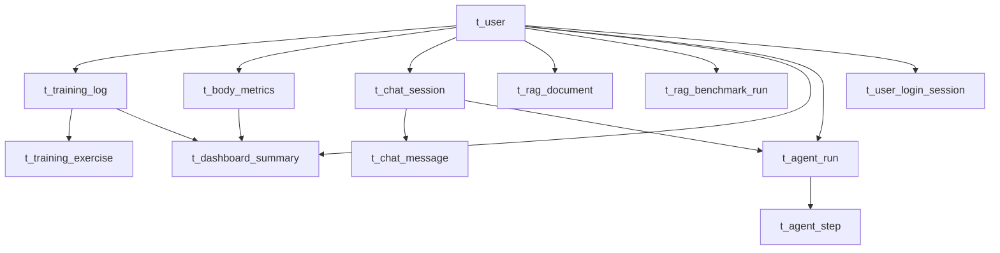

# Fit-Agent 数据库分阶段建设方案

## 1. 文档目标与边界

本文用于把历史数据库草案改造成可执行的分阶段建设方案，明确：

- 当前哪些能力已经有前端/后端代码证据
- 哪些表适合一期立即落地
- 哪些表必须延后到后续阶段
- 历史 8 张表在新方案中的去向
- 每个阶段具体建哪些表、为什么建、依赖什么能力

本文以当前仓库代码为准，不把历史文档草案视为当前事实。

### 1.1 主要证据来源

- 当前正式接口与前端占位边界：`API_DOCUMENTATION.md:43-57`、`API_DOCUMENTATION.md:760-849`
- 前端真实接口定义：`Fit-Agent-frontend/src/services/doctorApi.js:27-104`
- 前端训练/身体指标/总览状态：
  - `Fit-Agent-frontend/src/pages/spring-ai/SpringAiPage.vue:271-291`
  - `Fit-Agent-frontend/src/pages/spring-ai/SpringAiPage.vue:395-523`
  - `Fit-Agent-frontend/src/pages/spring-ai/components/TrainingLogView.vue:143-187`
  - `Fit-Agent-frontend/src/pages/spring-ai/components/BodyMetricsView.vue:142-175`
  - `Fit-Agent-frontend/src/pages/spring-ai/components/DashboardView.vue:13-93`
- 后端聊天与 RAG 的真实持久化边界：
  - `Fit-Agent-backend/mcp-client/src/main/java/com/itgeo/service/impl/ChatServiceImpl.java:72-90`
  - `Fit-Agent-backend/mcp-client/src/main/java/com/itgeo/service/impl/ChatServiceImpl.java:108-141`
  - `Fit-Agent-backend/mcp-client/src/main/java/com/itgeo/service/impl/ChatServiceImpl.java:159-188`
  - `Fit-Agent-backend/mcp-client/src/main/java/com/itgeo/service/impl/DocumentServiceImpl.java:20-40`
  - `Fit-Agent-backend/mcp-client/src/main/resources/application.yml:13-23`
- 仓库内已有的 MySQL / MyBatis 基础设施：
  - `Fit-Agent-backend/mcp-server/pom.xml:38-49`
  - `Fit-Agent-backend/mcp-server/src/main/resources/application-dev.yml:5-19`
- 历史 8 张表草案来源：旧文档提交 `f8cc0fa` 中的 `API_DOCUMENTATION.md:798-972`

---

## 2. 当前仓库事实

### 2.1 当前正式后端契约

当前正式已实现接口仍然集中在 `mcp-client`：

- `/chat/*`
- `/rag/*`
- `/internet/*`
- `/sse/*`
- `/hello/*`

这部分是当前可以直接联调的真实契约。

### 2.2 当前前端已存在但后端未实现的能力

前端已经预留，但后端尚未落地：

- `GET /chat/records?who=...`
- `POST /agent/execute`
- `POST /rag/config`
- `GET /rag/docs`
- `POST /rag/benchmark/evaluate`
- `POST /training/log`
- `GET /training/recent`
- `POST /body-metrics/log`
- `GET /body-metrics/recent`

这些能力是数据库方案的主要驱动来源。

### 2.3 当前 RAG 的真实存储不是 MySQL

当前 `mcp-client` 的 RAG 真实持久化证据是：

- `RedisVectorStore`
- `spring.ai.vectorstore.redis`
- Redis 连接配置

因此：

- `t_rag_document` 不能被设计成向量主存储表
- 关系库只适合承载文档元数据、状态、配置与审计信息

### 2.4 当前仓库中 MySQL 基础设施在哪

仓库里确实有 MySQL + MyBatis-Plus 基础设施，但在 `mcp-server` 模块，不在当前对外正式 HTTP API 所在的 `mcp-client` 模块。

这意味着分阶段建表前，必须先做一个基础决策：

1. 把关系库能力直接补进 `mcp-client`
2. 或抽一个共享 persistence 模块供 `mcp-client` / `mcp-server` 共用
3. 不建议让当前正式 HTTP API 依赖另一个示例模块绕路落库

### 2.5 当前最清晰、最值得优先落地的数据域

从前端表单与页面消费形态看，当前最清晰的数据域是：

- 训练记录
- 训练动作明细
- 身体指标

其次才是：

- 聊天记录
- RAG 文档元数据
- RAG 配置
- Dashboard 聚合/快照
- Agent 运行轨迹

---

## 3. 历史 8 张表的去向总表

| 历史表名              | 是否建议原样保留               | 所属阶段  | 新方案去向                               | 结论                                               |
| --------------------- | ------------------------------ | --------- | ---------------------------------------- | -------------------------------------------------- |
| `t_user`              | 是，且需前置                   | 第 0 阶段 | 身份主数据表                             | 标准化方案下必须先落，后续业务表统一引用 `user_id` |
| `t_chat_record`       | 否                             | 第 2 阶段 | 拆为 `t_chat_session` + `t_chat_message` | 原单表不利于会话化与多来源消息扩展                 |
| `t_training_log`      | 是，但需补 `user_id` 外键      | 第 1 阶段 | 保留为训练主表                           | 一期必须落地                                       |
| `t_training_exercise` | 是                             | 第 1 阶段 | 保留为训练明细表                         | 一期必须落地                                       |
| `t_body_metrics`      | 是，但需补 `user_id` 外键      | 第 1 阶段 | 保留为身体指标事实表                     | 一期必须落地                                       |
| `t_rag_document`      | 是，但只能做元数据             | 第 3 阶段 | 保留为 RAG 文档元数据表                  | 不承担向量本体                                     |
| `t_rag_config`        | 是，但需改为标准化作用域配置表 | 第 3 阶段 | 保留并增强为作用域配置表                 | 用户作用域统一落到 `t_user.id`                     |
| `t_dashboard_summary` | 是，但改为聚合快照表           | 第 4 阶段 | 保留为总览快照表                         | 必须建立在前序事实表之上                           |

补充：

- `POST /agent/execute` 与 `POST /rag/benchmark/evaluate` 对应的持久化需求并不在旧 8 张表内。
- 为了让方案完整，本文把它们作为扩展表放到后续阶段说明。
- 如果正式登录采用有状态 refresh token，还可以在第 0 阶段补充 `t_user_login_session`，但它不属于旧 8 张表。

---

## 4. 分阶段建设总览

| 阶段      | 目标                              | 本阶段建设表                                                 | 本阶段不建设表                                                           | 进入条件                                                         |
| --------- | --------------------------------- | ------------------------------------------------------------ | ------------------------------------------------------------------------ | ---------------------------------------------------------------- |
| 第 0 阶段 | 持久化基础与用户主数据            | `t_user`、可选 `t_user_login_session`                        | 其余业务表                                                               | 确认持久化模块、统一身份解析规则、确定迁移方式                   |
| 第 1 阶段 | 打通训练与身体指标闭环            | `t_training_log`、`t_training_exercise`、`t_body_metrics`    | `t_chat_record`、`t_rag_document`、`t_rag_config`、`t_dashboard_summary` | 已具备 `t_user`，准备实现 `/training/*` 与 `/body-metrics/*`     |
| 第 2 阶段 | 打通聊天历史与会话检索            | `t_chat_session`、`t_chat_message`                           | 不直接建旧 `t_chat_record`                                               | 准备实现 `/chat/records` 或 `/chat/sessions/{sessionId}/records` |
| 第 3 阶段 | 打通 RAG 文档列表、配置与评测记录 | `t_rag_document`、`t_rag_config`、可选 `t_rag_benchmark_run` | `t_dashboard_summary`、`t_agent_run`、`t_agent_step`                     | 准备实现 `/rag/docs`、`/rag/config`、`/rag/benchmark/evaluate`   |
| 第 4 阶段 | 补全总览快照与 Agent 审计         | `t_dashboard_summary`、可选 `t_agent_run`、`t_agent_step`    | 无                                                                       | 前序事实表已经稳定，报表与审计需求正式进入开发                   |

---

## 5. 第 0 阶段：持久化基础与用户主数据

第 0 阶段先解决两件事：

1. 正式 HTTP 服务如何接入关系库
2. 所有后续业务表统一引用哪个用户主键

### 5.1 持久化落点

建议优先采用以下两种之一：

- 方案 A：把 MySQL 持久化能力直接补进 `mcp-client`
- 方案 B：抽一个共享 persistence 模块，让 `mcp-client` 直接依赖

不建议：

- 继续让当前正式 HTTP API 通过 `mcp-server` 示例模块间接落库

### 5.2 标准化身份模型

标准化方案下，数据库统一采用：

- `t_user.id` 作为正式主键
- `t_user.user_key` 作为兼容键 / 外部稳定业务标识
- 所有业务事实表统一使用 `user_id BIGINT`

这意味着：

- `user_key` 只保留在 `t_user` 内部和接口兼容层使用
- 训练、身体指标、聊天、RAG、Dashboard 等业务表不再把 `user_key` 当主关联字段
- 后续正式登录接入后，不需要再对所有业务表做二次主关联迁移

### 5.3 当前测试阶段的兼容解析链路

考虑到当前前端仍可能传：

- `headerUserId`
- `who`
- `currentUserName`

建议统一解析顺序：

1. 优先使用后端认证上下文中的用户主键
2. 如果没有认证上下文，则用 `headerUserId` 映射到 `t_user.user_key`
3. 如果只有 `who` 或 `currentUserName`，也统一映射到 `t_user.user_key`
4. 找到 `t_user` 记录后，再解析出最终的 `user_id`
5. 所有业务表只写 `user_id`

如果当前只是测试功能，可以采用“测试账号自动补全”策略：

- 当 `user_key` 不存在时，自动创建一条测试用户记录
- 但真正落到业务表的一律仍是 `t_user.id`

### 5.4 迁移方式

建议在正式落库前接入数据库迁移工具，例如：

- Flyway
- Liquibase

至少保证：

- 每个阶段的 DDL 可重复执行
- 变更可追踪
- 后续加索引、补字段、拆表时可管理

### 5.5 用户主数据表 `t_user`

```sql
CREATE TABLE `t_user` (
    `id` BIGINT NOT NULL AUTO_INCREMENT COMMENT '用户主键',
    `user_key` VARCHAR(64) NOT NULL COMMENT '外部稳定业务标识，兼容旧接口与测试账号',
    `username` VARCHAR(64) NOT NULL COMMENT '登录名',
    `password_hash` VARCHAR(255) DEFAULT NULL COMMENT '密码哈希，测试阶段可为空',
    `nickname` VARCHAR(100) DEFAULT NULL COMMENT '昵称',
    `email` VARCHAR(100) DEFAULT NULL COMMENT '邮箱',
    `phone` VARCHAR(20) DEFAULT NULL COMMENT '手机号',
    `status` TINYINT NOT NULL DEFAULT 1 COMMENT '0-禁用 1-正常',
    `last_login_at` DATETIME DEFAULT NULL COMMENT '最近登录时间',
    `created_at` DATETIME NOT NULL DEFAULT CURRENT_TIMESTAMP,
    `updated_at` DATETIME NOT NULL DEFAULT CURRENT_TIMESTAMP ON UPDATE CURRENT_TIMESTAMP,
    PRIMARY KEY (`id`),
    UNIQUE KEY `uk_user_user_key` (`user_key`),
    UNIQUE KEY `uk_user_username` (`username`),
    UNIQUE KEY `uk_user_email` (`email`),
    KEY `idx_user_status` (`status`)
) ENGINE=InnoDB DEFAULT CHARSET=utf8mb4 COLLATE=utf8mb4_unicode_ci COMMENT='用户主数据表';
```

设计说明：

- `id` 是后续所有业务表要引用的正式外键
- `user_key` 用于兼容当前前端的轻量身份传参
- `password_hash` 在测试阶段可以为空，正式登录落地时再启用
- 当前阶段不需要一次性扩成完整账号中心，但 `t_user` 必须先有

### 5.6 可选登录会话表 `t_user_login_session`

如果后续采用有状态 refresh token，可以补充该表；如果采用完全无状态 JWT，可先跳过。

```sql
CREATE TABLE `t_user_login_session` (
    `id` BIGINT NOT NULL AUTO_INCREMENT COMMENT '登录会话主键',
    `user_id` BIGINT NOT NULL COMMENT '所属用户主键',
    `refresh_token_hash` VARCHAR(128) NOT NULL COMMENT '刷新令牌哈希',
    `client_ip` VARCHAR(64) DEFAULT NULL COMMENT '客户端 IP',
    `user_agent` VARCHAR(255) DEFAULT NULL COMMENT '客户端 UA',
    `expired_at` DATETIME NOT NULL COMMENT '过期时间',
    `revoked_at` DATETIME DEFAULT NULL COMMENT '撤销时间',
    `created_at` DATETIME NOT NULL DEFAULT CURRENT_TIMESTAMP,
    PRIMARY KEY (`id`),
    UNIQUE KEY `uk_login_session_token` (`refresh_token_hash`),
    KEY `idx_login_session_user` (`user_id`, `created_at`),
    KEY `idx_login_session_expired` (`expired_at`),
    CONSTRAINT `fk_login_session_user` FOREIGN KEY (`user_id`) REFERENCES `t_user` (`id`)
) ENGINE=InnoDB DEFAULT CHARSET=utf8mb4 COLLATE=utf8mb4_unicode_ci COMMENT='登录会话表';
```

---

## 6. 第 1 阶段：训练与身体指标一期落地

### 6.1 本阶段目标

本阶段只解决最清晰、最容易闭环的事实数据：

- 训练日志写入
- 最近训练读取
- 身体指标写入
- 近期指标读取
- 为 dashboard 后续聚合提供原始数据

### 6.2 本阶段建设表

- `t_training_log`
- `t_training_exercise`
- `t_body_metrics`

### 6.3 本阶段不建设表

- `t_chat_record`
- `t_rag_document`
- `t_rag_config`
- `t_dashboard_summary`

### 6.4 一期表设计

#### 6.4.1 训练主表 `t_training_log`

```sql
CREATE TABLE `t_training_log` (
    `id` BIGINT NOT NULL AUTO_INCREMENT COMMENT '训练主表ID',
    `user_id` BIGINT NOT NULL COMMENT '所属用户主键',
    `training_date` DATE NOT NULL COMMENT '训练日期',
    `summary` VARCHAR(500) DEFAULT NULL COMMENT '训练摘要，供 recent 列表直接展示',
    `primary_muscle_group` VARCHAR(64) DEFAULT NULL COMMENT '主要训练肌群，可为空',
    `total_volume` DECIMAL(12,2) NOT NULL DEFAULT 0 COMMENT '当日总训练量，便于周统计聚合',
    `source` VARCHAR(20) NOT NULL DEFAULT 'manual' COMMENT '来源：manual/chat/import',
    `created_at` DATETIME NOT NULL DEFAULT CURRENT_TIMESTAMP,
    `updated_at` DATETIME NOT NULL DEFAULT CURRENT_TIMESTAMP ON UPDATE CURRENT_TIMESTAMP,
    PRIMARY KEY (`id`),
    UNIQUE KEY `uk_training_user_date` (`user_id`, `training_date`),
    KEY `idx_training_user_date` (`user_id`, `training_date`),
    KEY `idx_training_created_at` (`created_at`),
    CONSTRAINT `fk_training_log_user` FOREIGN KEY (`user_id`) REFERENCES `t_user` (`id`)
) ENGINE=InnoDB DEFAULT CHARSET=utf8mb4 COLLATE=utf8mb4_unicode_ci COMMENT='训练主表';
```

设计说明：

- `summary` 保留下来，是因为前端最近训练列表直接消费 `record.summary`
- `total_volume` 保留下来，是因为 dashboard 周概览直接关心总训练量
- 当前前端并未采集 `calories_burned`、`feeling`、`duration`，因此不在一期强塞这些字段

#### 6.4.2 训练动作明细表 `t_training_exercise`

```sql
CREATE TABLE `t_training_exercise` (
    `id` BIGINT NOT NULL AUTO_INCREMENT COMMENT '训练动作明细ID',
    `training_log_id` BIGINT NOT NULL COMMENT '所属训练主表ID',
    `exercise_name` VARCHAR(100) NOT NULL COMMENT '动作名称',
    `sets` INT NOT NULL DEFAULT 1 COMMENT '组数',
    `reps` INT NOT NULL DEFAULT 1 COMMENT '每组次数',
    `weight` DECIMAL(8,2) NOT NULL DEFAULT 0 COMMENT '重量 kg',
    `order_num` INT NOT NULL DEFAULT 0 COMMENT '动作顺序',
    `estimated_muscle_group` VARCHAR(64) DEFAULT NULL COMMENT '可选的推断肌群',
    `created_at` DATETIME NOT NULL DEFAULT CURRENT_TIMESTAMP,
    PRIMARY KEY (`id`),
    KEY `idx_exercise_training_log_id` (`training_log_id`),
    CONSTRAINT `fk_exercise_training_log` FOREIGN KEY (`training_log_id`) REFERENCES `t_training_log` (`id`)
) ENGINE=InnoDB DEFAULT CHARSET=utf8mb4 COLLATE=utf8mb4_unicode_ci COMMENT='训练动作明细表';
```

设计说明：

- 训练表单天然是一对多，不能拍扁到主表
- `order_num` 用于保留前端录入顺序
- `estimated_muscle_group` 可留空，为后续统计预留

#### 6.4.3 身体指标表 `t_body_metrics`

```sql
CREATE TABLE `t_body_metrics` (
    `id` BIGINT NOT NULL AUTO_INCREMENT COMMENT '身体指标记录ID',
    `user_id` BIGINT NOT NULL COMMENT '所属用户主键',
    `record_date` DATE NOT NULL COMMENT '记录日期',
    `weight` DECIMAL(5,2) DEFAULT NULL COMMENT '体重 kg',
    `body_fat` DECIMAL(4,2) DEFAULT NULL COMMENT '体脂 %',
    `sleep_hours` DECIMAL(3,1) DEFAULT NULL COMMENT '睡眠时长 h',
    `fatigue_level` VARCHAR(16) DEFAULT NULL COMMENT '疲劳度：低/中/高',
    `note` VARCHAR(500) DEFAULT NULL COMMENT '备注',
    `summary` VARCHAR(500) DEFAULT NULL COMMENT '近期变化摘要，供 recent 列表展示',
    `created_at` DATETIME NOT NULL DEFAULT CURRENT_TIMESTAMP,
    `updated_at` DATETIME NOT NULL DEFAULT CURRENT_TIMESTAMP ON UPDATE CURRENT_TIMESTAMP,
    PRIMARY KEY (`id`),
    UNIQUE KEY `uk_metrics_user_date` (`user_id`, `record_date`),
    KEY `idx_metrics_user_date` (`user_id`, `record_date`),
    KEY `idx_metrics_created_at` (`created_at`),
    CONSTRAINT `fk_body_metrics_user` FOREIGN KEY (`user_id`) REFERENCES `t_user` (`id`)
) ENGINE=InnoDB DEFAULT CHARSET=utf8mb4 COLLATE=utf8mb4_unicode_ci COMMENT='身体指标事实表';
```

设计说明：

- 当前前端真实字段只有 `weight/bodyFat/sleep/fatigue/note/date`
- 因此前期不建议把 BMI、围度、心情等未采集字段一次性塞满
- `summary` 同样用于最近记录列表快速展示

### 6.5 一期接口到表映射

| 接口                       | 写入/读取表                             | 说明                                        |
| -------------------------- | --------------------------------------- | ------------------------------------------- |
| `POST /training/log`       | `t_training_log`、`t_training_exercise` | 先解析 `t_user.id`，再写主表与明细          |
| `GET /training/recent`     | `t_training_log`                        | 先解析 `t_user.id`，再返回 `date + summary` |
| `POST /body-metrics/log`   | `t_body_metrics`                        | 先解析 `t_user.id`，再写身体指标事实        |
| `GET /body-metrics/recent` | `t_body_metrics`                        | 先解析 `t_user.id`，再返回 `date + summary` |

### 6.6 本阶段进入完成条件

- `/training/log` 可写入主表与明细表
- `/training/recent` 返回最近训练摘要
- `/body-metrics/log` 可写入当天身体指标
- `/body-metrics/recent` 返回最近指标摘要
- dashboard 所需的 `todayStatus`、`weekSummary` 已可从一期事实表聚合得到

---

## 7. 第 2 阶段：聊天记录与会话模型

### 7.1 本阶段目标

本阶段解决：

- `/chat/records?who=...`
- 后续 `/chat/sessions/{sessionId}/records`
- `chat/rag/internet/agent` 多来源消息统一持久化

### 7.2 为什么不建议直接建旧 `t_chat_record`

旧 `t_chat_record` 的问题在于：

- 过于偏单表日志思维
- 不利于会话级聚合
- 不利于未来的消息来源扩展
- 当前接口命名已经明显朝 `sessionId` 演进

因此建议 Phase 2 直接采用：

- `t_chat_session`
- `t_chat_message`

### 7.3 本阶段建设表

#### 7.3.1 会话表 `t_chat_session`

```sql
CREATE TABLE `t_chat_session` (
    `id` BIGINT NOT NULL AUTO_INCREMENT COMMENT '会话主键',
    `session_code` VARCHAR(64) NOT NULL COMMENT '对外会话标识',
    `user_id` BIGINT NOT NULL COMMENT '所属用户主键',
    `scene_type` VARCHAR(20) NOT NULL DEFAULT 'chat' COMMENT 'chat/rag/internet/agent',
    `title` VARCHAR(200) DEFAULT NULL COMMENT '会话标题，可由首条消息生成',
    `last_bot_msg_id` VARCHAR(64) DEFAULT NULL COMMENT '最近机器人消息ID',
    `created_at` DATETIME NOT NULL DEFAULT CURRENT_TIMESTAMP,
    `updated_at` DATETIME NOT NULL DEFAULT CURRENT_TIMESTAMP ON UPDATE CURRENT_TIMESTAMP,
    PRIMARY KEY (`id`),
    UNIQUE KEY `uk_chat_session_code` (`session_code`),
    KEY `idx_chat_session_user` (`user_id`, `updated_at`),
    KEY `idx_chat_session_scene` (`scene_type`, `updated_at`),
    CONSTRAINT `fk_chat_session_user` FOREIGN KEY (`user_id`) REFERENCES `t_user` (`id`)
) ENGINE=InnoDB DEFAULT CHARSET=utf8mb4 COLLATE=utf8mb4_unicode_ci COMMENT='聊天会话表';
```

#### 7.3.2 消息表 `t_chat_message`

```sql
CREATE TABLE `t_chat_message` (
    `id` BIGINT NOT NULL AUTO_INCREMENT COMMENT '消息主键',
    `session_id` BIGINT NOT NULL COMMENT '所属会话主键',
    `seq_no` INT NOT NULL DEFAULT 0 COMMENT '消息顺序',
    `role` VARCHAR(20) NOT NULL COMMENT 'user/assistant/system',
    `message_type` VARCHAR(20) NOT NULL DEFAULT 'text' COMMENT '消息类型',
    `source_type` VARCHAR(20) NOT NULL DEFAULT 'chat' COMMENT 'chat/rag/internet/agent',
    `content` LONGTEXT NOT NULL COMMENT '消息正文',
    `bot_msg_id` VARCHAR(64) DEFAULT NULL COMMENT '机器人消息ID',
    `sources_json` JSON DEFAULT NULL COMMENT '可选的知识来源列表',
    `created_at` DATETIME NOT NULL DEFAULT CURRENT_TIMESTAMP,
    PRIMARY KEY (`id`),
    KEY `idx_chat_message_session_seq` (`session_id`, `seq_no`),
    KEY `idx_chat_message_bot` (`bot_msg_id`),
    KEY `idx_chat_message_created` (`created_at`),
    CONSTRAINT `fk_chat_message_session` FOREIGN KEY (`session_id`) REFERENCES `t_chat_session` (`id`)
) ENGINE=InnoDB DEFAULT CHARSET=utf8mb4 COLLATE=utf8mb4_unicode_ci COMMENT='聊天消息表';
```

### 7.4 与当前前端占位的兼容策略

当前前端占位还是：

```text
GET /chat/records?who=...
```

Phase 2 的兼容落地建议：

1. 先用 `who -> t_user.user_key -> t_user.id`
2. 再为该用户找到最近活跃会话
3. 返回该会话下消息列表
4. 后续再把前端演进到：
   - `GET /chat/records`
   - `GET /chat/sessions/{sessionId}/records`

说明：

- `who`、`currentUserName`、`headerUserId` 只出现在接口兼容层
- 真正落表的一律是 `user_id`
- 不再直接把 `user_key` 写进聊天业务表

### 7.5 如果必须保留旧表名怎么办

如果短期必须沿用旧名，也不建议直接照旧 DDL 建表；最保守的兼容方式是：

- 仍按 `t_chat_session + t_chat_message` 建真实表
- 如确有兼容需要，再提供一个 `v_chat_record` 视图或兼容 DTO

而不是把真实模型压回单表。

---

## 8. 第 3 阶段：RAG 元数据、配置与评测记录

### 8.1 本阶段目标

本阶段解决：

- `/rag/docs`
- `/rag/config`
- `/rag/benchmark/evaluate`

前提是继续保持：

- RedisVectorStore 负责 embedding / similarity search
- MySQL 只负责元数据、配置与评测记录

### 8.2 本阶段建设表

- `t_rag_document`
- `t_rag_config`
- 可选 `t_rag_benchmark_run`

### 8.3 文档元数据表 `t_rag_document`

```sql
CREATE TABLE `t_rag_document` (
    `id` BIGINT NOT NULL AUTO_INCREMENT COMMENT '文档主键',
    `user_id` BIGINT DEFAULT NULL COMMENT '上传用户主键，系统文档可为空',
    `file_name` VARCHAR(255) NOT NULL COMMENT '展示文件名',
    `file_hash` VARCHAR(64) DEFAULT NULL COMMENT '内容哈希，便于去重',
    `file_type` VARCHAR(50) DEFAULT NULL COMMENT 'txt/pdf/md/docx 等',
    `file_size` BIGINT NOT NULL DEFAULT 0 COMMENT '文件大小',
    `storage_uri` VARCHAR(500) DEFAULT NULL COMMENT '原文件存储位置',
    `chunk_count` INT NOT NULL DEFAULT 0 COMMENT '切片数量',
    `vector_status` VARCHAR(20) NOT NULL DEFAULT 'pending' COMMENT 'pending/processing/completed/failed',
    `metadata_json` JSON DEFAULT NULL COMMENT '额外元数据',
    `created_at` DATETIME NOT NULL DEFAULT CURRENT_TIMESTAMP,
    `updated_at` DATETIME NOT NULL DEFAULT CURRENT_TIMESTAMP ON UPDATE CURRENT_TIMESTAMP,
    PRIMARY KEY (`id`),
    UNIQUE KEY `uk_rag_file_hash` (`file_hash`),
    KEY `idx_rag_document_user` (`user_id`, `created_at`),
    KEY `idx_rag_document_status` (`vector_status`, `updated_at`),
    CONSTRAINT `fk_rag_document_user` FOREIGN KEY (`user_id`) REFERENCES `t_user` (`id`)
) ENGINE=InnoDB DEFAULT CHARSET=utf8mb4 COLLATE=utf8mb4_unicode_ci COMMENT='RAG 文档元数据表';
```

设计说明：

- 只记录文档元数据，不存向量
- `file_hash` 便于幂等上传与去重
- `vector_status` 便于前端展示处理状态
- `user_id` 可为空，用于兼容系统级公共文档

### 8.4 配置表 `t_rag_config`

```sql
CREATE TABLE `t_rag_config` (
    `id` BIGINT NOT NULL AUTO_INCREMENT COMMENT '配置主键',
    `scope_type` VARCHAR(20) NOT NULL COMMENT 'global/user/document',
    `scope_id` BIGINT NOT NULL DEFAULT 0 COMMENT 'global 固定为 0；user 为 t_user.id；document 为 t_rag_document.id',
    `config_key` VARCHAR(100) NOT NULL COMMENT '配置键',
    `config_value_json` JSON NOT NULL COMMENT '配置值，推荐 JSON 保存',
    `description` VARCHAR(255) DEFAULT NULL COMMENT '配置描述',
    `created_by_user_id` BIGINT DEFAULT NULL COMMENT '创建人用户主键',
    `created_at` DATETIME NOT NULL DEFAULT CURRENT_TIMESTAMP,
    `updated_at` DATETIME NOT NULL DEFAULT CURRENT_TIMESTAMP ON UPDATE CURRENT_TIMESTAMP,
    PRIMARY KEY (`id`),
    UNIQUE KEY `uk_rag_config_scope` (`scope_type`, `scope_id`, `config_key`),
    KEY `idx_rag_config_creator` (`created_by_user_id`),
    CONSTRAINT `fk_rag_config_creator` FOREIGN KEY (`created_by_user_id`) REFERENCES `t_user` (`id`)
) ENGINE=InnoDB DEFAULT CHARSET=utf8mb4 COLLATE=utf8mb4_unicode_ci COMMENT='RAG 配置表';
```

设计说明：

- 用户作用域统一通过 `scope_type='user' + scope_id=t_user.id` 表示
- 文档作用域统一通过 `scope_type='document' + scope_id=t_rag_document.id` 表示
- 由于 `scope_id` 是多态作用域字段，数据库层不直接建立物理外键，由应用层保证作用域合法性
- `created_by_user_id` 保留正式用户外键，方便审计

### 8.5 可选评测记录表 `t_rag_benchmark_run`

> 该表不属于旧 8 张表，但为了覆盖前端现有占位接口，建议作为第 3 阶段可选扩展表。

```sql
CREATE TABLE `t_rag_benchmark_run` (
    `id` BIGINT NOT NULL AUTO_INCREMENT COMMENT '评测任务主键',
    `user_id` BIGINT DEFAULT NULL COMMENT '发起用户主键',
    `dataset_name` VARCHAR(100) DEFAULT NULL COMMENT '评测数据集名称',
    `question_count` INT NOT NULL DEFAULT 0 COMMENT '评测问题数',
    `status` VARCHAR(20) NOT NULL DEFAULT 'pending' COMMENT 'pending/running/success/failed',
    `config_snapshot_json` JSON DEFAULT NULL COMMENT '评测时配置快照',
    `result_json` JSON DEFAULT NULL COMMENT '评测输出结果',
    `created_at` DATETIME NOT NULL DEFAULT CURRENT_TIMESTAMP,
    `updated_at` DATETIME NOT NULL DEFAULT CURRENT_TIMESTAMP ON UPDATE CURRENT_TIMESTAMP,
    PRIMARY KEY (`id`),
    KEY `idx_benchmark_user` (`user_id`, `created_at`),
    KEY `idx_benchmark_status` (`status`, `updated_at`),
    CONSTRAINT `fk_benchmark_user` FOREIGN KEY (`user_id`) REFERENCES `t_user` (`id`)
) ENGINE=InnoDB DEFAULT CHARSET=utf8mb4 COLLATE=utf8mb4_unicode_ci COMMENT='RAG 评测任务表';
```

---

## 9. 第 4 阶段：Dashboard 快照与 Agent 审计

### 9.1 本阶段目标

本阶段不是为了补基础事实数据，而是为以下能力服务：

- dashboard 快照 / 缓存
- Agent 执行审计与排障
- 周报 / 报表持久化

### 9.2 本阶段建设表

- `t_dashboard_summary`
- 可选 `t_agent_run`
- 可选 `t_agent_step`

### 9.3 Dashboard 快照表 `t_dashboard_summary`

> 该表只应作为聚合快照 / 缓存结果表，不应替代训练与身体指标事实表。

```sql
CREATE TABLE `t_dashboard_summary` (
    `id` BIGINT NOT NULL AUTO_INCREMENT COMMENT '快照主键',
    `user_id` BIGINT NOT NULL COMMENT '所属用户主键',
    `summary_date` DATE NOT NULL COMMENT '快照日期',
    `summary_type` VARCHAR(20) NOT NULL DEFAULT 'daily' COMMENT 'daily/weekly/monthly',
    `training_days` INT NOT NULL DEFAULT 0 COMMENT '周期内训练天数',
    `total_volume` DECIMAL(12,2) NOT NULL DEFAULT 0 COMMENT '周期总训练量',
    `avg_weight` DECIMAL(5,2) DEFAULT NULL COMMENT '平均体重',
    `weight_change` DECIMAL(5,2) DEFAULT NULL COMMENT '体重变化',
    `fatigue_level` VARCHAR(16) DEFAULT NULL COMMENT '疲劳概况',
    `result_summary_json` JSON DEFAULT NULL COMMENT '最近执行结果摘要',
    `report_content` LONGTEXT DEFAULT NULL COMMENT '报表正文或周报预览',
    `generated_at` DATETIME NOT NULL DEFAULT CURRENT_TIMESTAMP COMMENT '生成时间',
    PRIMARY KEY (`id`),
    UNIQUE KEY `uk_dashboard_summary` (`user_id`, `summary_date`, `summary_type`),
    KEY `idx_dashboard_generated` (`generated_at`),
    CONSTRAINT `fk_dashboard_summary_user` FOREIGN KEY (`user_id`) REFERENCES `t_user` (`id`)
) ENGINE=InnoDB DEFAULT CHARSET=utf8mb4 COLLATE=utf8mb4_unicode_ci COMMENT='Dashboard 聚合快照表';
```

### 9.4 可选 Agent 运行主表 `t_agent_run`

```sql
CREATE TABLE `t_agent_run` (
    `id` BIGINT NOT NULL AUTO_INCREMENT COMMENT 'Agent 运行主键',
    `user_id` BIGINT DEFAULT NULL COMMENT '发起用户主键',
    `chat_session_id` BIGINT DEFAULT NULL COMMENT '关联聊天会话主键，可为空',
    `request_text` LONGTEXT DEFAULT NULL COMMENT '原始任务输入',
    `status` VARCHAR(20) NOT NULL DEFAULT 'pending' COMMENT 'pending/running/success/failed',
    `result_json` JSON DEFAULT NULL COMMENT '执行结果摘要',
    `error_message` VARCHAR(500) DEFAULT NULL COMMENT '错误信息',
    `started_at` DATETIME DEFAULT NULL,
    `finished_at` DATETIME DEFAULT NULL,
    `created_at` DATETIME NOT NULL DEFAULT CURRENT_TIMESTAMP,
    PRIMARY KEY (`id`),
    KEY `idx_agent_run_user` (`user_id`, `created_at`),
    KEY `idx_agent_run_status` (`status`, `created_at`),
    KEY `idx_agent_run_session` (`chat_session_id`),
    CONSTRAINT `fk_agent_run_user` FOREIGN KEY (`user_id`) REFERENCES `t_user` (`id`),
    CONSTRAINT `fk_agent_run_session` FOREIGN KEY (`chat_session_id`) REFERENCES `t_chat_session` (`id`)
) ENGINE=InnoDB DEFAULT CHARSET=utf8mb4 COLLATE=utf8mb4_unicode_ci COMMENT='Agent 运行主表';
```

### 9.5 可选 Agent 步骤表 `t_agent_step`

```sql
CREATE TABLE `t_agent_step` (
    `id` BIGINT NOT NULL AUTO_INCREMENT COMMENT 'Agent 步骤主键',
    `agent_run_id` BIGINT NOT NULL COMMENT '所属 Agent 运行主键',
    `step_no` INT NOT NULL DEFAULT 0 COMMENT '步骤序号',
    `step_name` VARCHAR(100) NOT NULL COMMENT '步骤名称',
    `step_status` VARCHAR(20) NOT NULL DEFAULT 'pending' COMMENT 'pending/running/success/failed',
    `tool_name` VARCHAR(100) DEFAULT NULL COMMENT '调用工具名称',
    `input_json` JSON DEFAULT NULL COMMENT '步骤输入',
    `output_json` JSON DEFAULT NULL COMMENT '步骤输出',
    `error_message` VARCHAR(500) DEFAULT NULL COMMENT '错误信息',
    `started_at` DATETIME DEFAULT NULL,
    `finished_at` DATETIME DEFAULT NULL,
    `created_at` DATETIME NOT NULL DEFAULT CURRENT_TIMESTAMP,
    PRIMARY KEY (`id`),
    KEY `idx_agent_step_run` (`agent_run_id`, `step_no`),
    CONSTRAINT `fk_agent_step_run` FOREIGN KEY (`agent_run_id`) REFERENCES `t_agent_run` (`id`)
) ENGINE=InnoDB DEFAULT CHARSET=utf8mb4 COLLATE=utf8mb4_unicode_ci COMMENT='Agent 步骤表';
```

---

## 10. 建表顺序与依赖关系

### 10.1 推荐顺序

1. 第 0 阶段：`t_user`
2. 第 0 阶段可选：`t_user_login_session`
3. 第 1 阶段：`t_training_log`
4. 第 1 阶段：`t_training_exercise`
5. 第 1 阶段：`t_body_metrics`
6. 第 2 阶段：`t_chat_session`
7. 第 2 阶段：`t_chat_message`
8. 第 3 阶段：`t_rag_document`
9. 第 3 阶段：`t_rag_config`
10. 第 3 阶段可选：`t_rag_benchmark_run`
11. 第 4 阶段：`t_dashboard_summary`
12. 第 4 阶段可选：`t_agent_run`
13. 第 4 阶段可选：`t_agent_step`

### 10.2 依赖说明

- `t_training_log` 依赖 `t_user`
- `t_body_metrics` 依赖 `t_user`
- `t_training_exercise` 依赖 `t_training_log`
- `t_chat_session` 依赖 `t_user`
- `t_chat_message` 依赖 `t_chat_session`
- `t_rag_document` 依赖 `t_user`（可空外键）
- `t_rag_benchmark_run` 依赖 `t_user`（可空外键）
- `t_dashboard_summary` 依赖 `t_user` 与前序事实表
- `t_agent_run` 依赖 `t_user`，并可选依赖 `t_chat_session`
- `t_agent_step` 依赖 `t_agent_run`

### 10.3 依赖图



---

## 11. 接口与表的最终映射建议

说明：所有业务写入在真正落表前，都必须先把接口中的身份信息解析为 `t_user.id`。

| 接口                                                           | 所属阶段                    | 表                                                   |
| -------------------------------------------------------------- | --------------------------- | ---------------------------------------------------- |
| `POST /training/log`                                           | 第 1 阶段                   | `t_user` -> `t_training_log` + `t_training_exercise` |
| `GET /training/recent`                                         | 第 1 阶段                   | `t_user` -> `t_training_log`                         |
| `POST /body-metrics/log`                                       | 第 1 阶段                   | `t_user` -> `t_body_metrics`                         |
| `GET /body-metrics/recent`                                     | 第 1 阶段                   | `t_user` -> `t_body_metrics`                         |
| `POST /chat/doChat`                                            | 第 2 阶段后可追加落库       | `t_user` -> `t_chat_session` + `t_chat_message`      |
| `POST /rag/search`                                             | 第 2 阶段后可追加落聊天消息 | `t_user` -> `t_chat_session` + `t_chat_message`      |
| `POST /internet/search`                                        | 第 2 阶段后可追加落聊天消息 | `t_user` -> `t_chat_session` + `t_chat_message`      |
| `GET /chat/records` / `GET /chat/sessions/{sessionId}/records` | 第 2 阶段                   | `t_chat_session` + `t_chat_message`                  |
| `POST /rag/uploadRagDoc`                                       | 第 3 阶段增强               | RedisVectorStore + `t_rag_document`                  |
| `GET /rag/docs`                                                | 第 3 阶段                   | `t_rag_document`                                     |
| `POST /rag/config`                                             | 第 3 阶段                   | `t_rag_config`                                       |
| `POST /rag/benchmark/evaluate`                                 | 第 3 阶段可选               | `t_rag_benchmark_run`                                |
| `POST /agent/execute`                                          | 第 4 阶段可选增强           | `t_agent_run` + `t_agent_step`                       |

---

## 12. 实施建议

### 12.1 现在应该先做什么

如果现在就要进入编码，建议按下面顺序推进：

1. 在正式服务模块中接入关系库能力
2. 先创建 `t_user`
3. 先实现“接口身份 -> `t_user.id`”的统一解析链路
4. 再创建第 1 阶段三张表
5. 打通：
   - `/training/log`
   - `/training/recent`
   - `/body-metrics/log`
   - `/body-metrics/recent`
6. 然后再进入第 2 阶段聊天记录能力

### 12.2 哪些事情不要一起做

不要把下面这些任务捆在一次迭代里：

- 正式登录体系
- 聊天会话化
- RAG 配置中心
- Dashboard 快照
- Agent 审计

原因：

- 当前这几块成熟度不同
- 一起做会把真实需求和历史草案混在一起
- 会导致表过度设计、字段大量闲置

### 12.3 对旧 8 张表的最终取舍结论

- 先进入基础阶段与一期：
  - `t_user`
  - `t_training_log`
  - `t_training_exercise`
  - `t_body_metrics`
- 延后二期并重构：
  - `t_chat_record`
- 延后三期：
  - `t_rag_document`
  - `t_rag_config`
- 延后四期：
  - `t_dashboard_summary`

---

## 13. 风险与待确认项

### 13.1 持久化模块仍需最后拍板

当前正式 HTTP API 在 `mcp-client`，而 MySQL 基础设施在 `mcp-server`。这点必须先定，否则分阶段建表无法顺利落代码。

### 13.2 `user_id` 解析链路必须统一

建议统一优先级：

1. 后端认证上下文中的正式用户主键
2. `headerUserId` -> `t_user.user_key` -> `t_user.id`
3. 临时兼容 `currentUserName` / `who` -> `t_user.user_key` -> `t_user.id`
4. 测试阶段必要时自动补齐测试用户

### 13.3 聊天记录必须先确认会话模型

当前前端占位还是 `who`，但文档已经推荐演进到 `sessionId`。Phase 2 实施前应先统一这个模型。

### 13.4 `t_rag_config` 的作用域字段是多态关联

`scope_type + scope_id` 便于落地，但数据库层无法同时对 user/document 两种目标都建立物理外键，因此需要在应用层补充合法性校验。

### 13.5 Dashboard 快照不要先于事实表落地

如果先建 `t_dashboard_summary` 而没有稳定事实表，后续几乎一定返工。

---

## 14. 最终建议

- 标准化方案下，第一张必须先建的表是 `t_user`
- 一期再建训练与身体指标事实表
- 二期直接采用会话表 + 消息表，不再沿用旧 `t_chat_record`
- 三期补 RAG 元数据、配置和评测记录
- 四期再上 Dashboard 快照与 Agent 审计

如果后续需要，我可以继续基于本文档直接输出：

1. 第 0~1 阶段 SQL 文件
2. 第 2 阶段 SQL 文件
3. 对应的 Java DTO / Entity / Mapper / Controller 设计草案
4. 接口返回结构与前端字段映射清单
